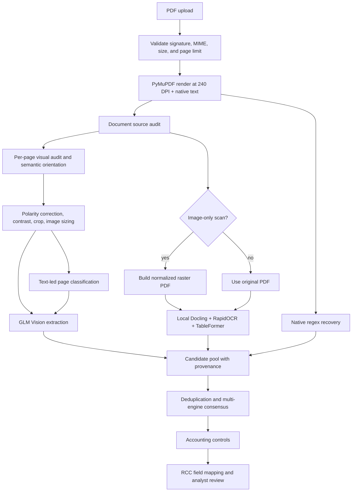
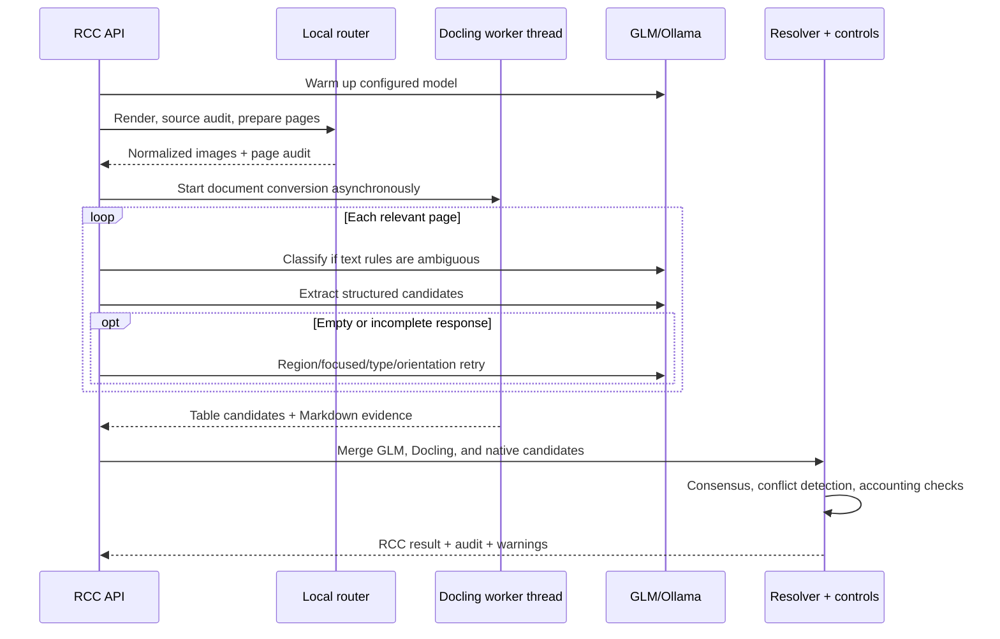

# RCC Hybrid OCR and Financial Extraction Pipeline

**Implementation:** `hybrid_local_evidence_v1`
**Document version:** 1.1
**Last verified:** 16 August 2026
**Status:** Implemented and smoke-tested
**Scope:** Moroccan RCC/PCGM financial statements processed by Wafabail RCC

## 1. Purpose

This document describes the functional behavior, technical architecture, operation, testing, and limitations of the new RCC hybrid OCR and extraction update.

The update improves the original GLM-only path for difficult financial statements, especially:

- pages rotated by 90, 180, or 270 degrees;
- dark-background or inverted scans;
- low-contrast and loosely cropped pages;
- mixed PDFs containing both selectable text and scanned pages;
- PCGM balance-sheet tables whose row and period structure must be preserved;
- cases where one extraction engine reads a value incorrectly.

The design is evidence-oriented. Native PDF text, RapidOCR observations, Docling/TableFormer tables, and GLM vision output are treated as observations with provenance. The resolver then compares these observations and runs accounting controls before values are exposed for analyst review.

This update does **not** include Mistral OCR. It adds no Mistral dependency, API key, request, or document transmission.

## 2. Executive summary

The original pipeline rendered each PDF page, estimated its orientation geometrically, classified it, and sent it to GLM Vision. The new pipeline keeps that GLM semantic extraction capability and adds a local document-understanding layer before and alongside it:

1. Audit the PDF's native-text coverage and classify it as `born_digital`, `hybrid`, or `image_only`.
2. Audit each page's visual quality, polarity, sharpness, and content bounds.
3. Correct inversion and weak contrast before semantic orientation so OCR can read dark scans.
4. Resolve scan orientation with RapidOCR across 0, 90, 180, and 270 degrees.
5. Crop useful content and create separate classification and extraction images.
6. Run a dedicated higher-resolution RapidOCR pass on the final upright scan.
7. Run Docling/TableFormer locally and concurrently with the existing GLM page extraction.
8. Convert native, Docling, and GLM findings into candidates that retain their source engine and extraction method.
9. Preserve corroborating observations, identify divergent observations, and apply accounting controls.
10. Return page-level audit data, field provenance, and a shared deterministic scoring view.

The update is deliberately fail-open: if RapidOCR or Docling is not installed or fails, the existing GLM route continues instead of rejecting the document.

## 3. Functional documentation

### 3.1 Users and functional goals

The primary user is an RCC analyst validating financial information before it is used in the Wafabail decision process. The update is intended to provide:

- more reliable reading of rotated and inverted financial statements;
- better preservation of row/column meaning in balance-sheet tables;
- visible traceability of where each value came from;
- explicit warnings for uncertain orientation or conflicting values;
- graceful continuation when an optional local engine is unavailable;
- unchanged analyst ownership of the final validation decision.

The system is not intended to approve a credit decision autonomously. OCR confidence and engine agreement are supporting evidence, not substitutes for analyst validation.

### 3.2 Supported document classes

The document router uses native-text coverage to classify the input.

| Source kind | Rule | Typical example | Processing behavior |
|---|---:|---|---|
| `born_digital` | At least 75% of pages contain 80 or more native characters | Export from accounting software | Preserve native text, keep rendered orientation at 0 degrees, run Docling on the original PDF, and run GLM on normalized page images |
| `hybrid` | More than 10% but less than 75% of pages contain enough native text | PDF with digital cover pages and scanned statements | Select the native or local-OCR page route independently, run Docling on the original mixed PDF, and run GLM |
| `image_only` | At most 10% of pages contain enough native text | Flatbed/mobile scan | Run four-way RapidOCR orientation, create an orientation-normalized raster PDF for Docling, and run GLM on normalized images |

The threshold is controlled by `NATIVE_TEXT_MIN_CHARS`, whose default is `80` characters per page.

### 3.3 Page routes

Each page receives a route label. The label explains the evidence available to the pipeline; it does not mean that the page bypasses GLM.

| Route | Condition | Meaning |
|---|---|---|
| `native_docling_glm` | The page contains enough native text | Native text is available for classification/recovery, Docling can contribute table evidence, and GLM performs semantic vision extraction |
| `hybrid_local_ocr_glm` | A hybrid page lacks enough native text but RapidOCR reads local text | Local OCR supports orientation/classification; Docling and GLM provide extraction evidence |
| `scan_local_ocr_glm` | An image-only page has a successful RapidOCR observation | The scan is normalized with local semantic orientation before Docling and GLM |
| `scan_glm_fallback` | Local OCR is missing, fails, or returns no useful text | The page continues through visual normalization and GLM; a warning records the missing local OCR signal |
| `legacy_glm` | `HYBRID_FINANCIAL_PIPELINE=false` | The pre-update GLM-oriented behavior is used |

### 3.4 User-visible workflow

The application continues to use asynchronous RCC jobs:

1. The analyst uploads a PDF with `POST /api/v1/rcc/jobs`.
2. The API validates the extension, MIME type, `%PDF` signature, size, and requested page limit.
3. The response returns a job ID, SSE stream URL, and result URL.
4. The frontend receives progress events while pages are rendered, prepared, classified, and extracted.
5. The analyst retrieves the final `RccAnalysisResult` from `GET /api/v1/rcc/jobs/{job_id}/result`.
6. The analyst reviews extracted values, warnings, evidence, and accounting-control results.

Useful job endpoints are:

| Method | Endpoint | Purpose |
|---|---|---|
| `POST` | `/api/v1/rcc/jobs` | Upload a PDF and create an extraction job |
| `GET` | `/api/v1/rcc/jobs/{job_id}` | Read current job progress |
| `GET` | `/api/v1/rcc/jobs/{job_id}/stream` | Receive Server-Sent Events |
| `GET` | `/api/v1/rcc/jobs/{job_id}/result` | Retrieve the completed RCC result |

These endpoints require an authenticated analyst session. Jobs are serialized by an application-level lock because the configured GLM service is handled as a single-model resource.

### 3.5 What the analyst can inspect

The extraction summary now exposes:

| Field | Meaning |
|---|---|
| `pipeline` | `hybrid_local_evidence_v1` when the new path is enabled; otherwise `glm_direct` |
| `source_kind` | Document source audit: `born_digital`, `hybrid`, or `image_only` |
| `engines` | Engines that contributed to processing, such as `native_pdf`, `rapidocr`, `docling_tableformer`, and `glm_vision` |
| `docling_status` | `success`, `not_installed`, `disabled`, or `error` |
| `docling_latency_ms` | Time spent in the local Docling conversion, when available |
| `warnings` | Document-level recovery, conflict, Docling, and accounting-control messages |

Each page audit exposes:

| Field | Meaning |
|---|---|
| `detected_type` | Classified financial page type |
| `orientation` | Selected correction angle: 0, 90, 180, or 270 |
| `orientation_method` | `native_text_rendered_orientation`, `rapidocr_semantic_cascade`, `geometry_fallback`, or the legacy method |
| `orientation_confidence` | Confidence in the selected orientation |
| `source_kind` / `route` | Document class and selected page path |
| `native_chars` | Number of usable native PDF text characters |
| `local_ocr_chars` | Number of local RapidOCR characters retained for the page |
| `inverted` | Whether dark polarity was detected and corrected |
| `docling_status` | Docling result propagated to the page audit |
| `extraction_strategy` | Full-page, region, focused retry, skipped, or other extraction strategy |
| `candidates_count` | Number of candidates produced for the page |
| `warnings` / `error` | Page-specific uncertainty and failure information |

Each field observation can preserve:

- `page_number` and `page_type`;
- the row label (`raw_label`);
- the interpreted period column (`column_name` and `column_role`);
- a short source excerpt;
- page orientation;
- `extraction_method`, such as `glm_direct_vision`, `docling_table`, or `native_pdf_regex`;
- the concrete `engine` that produced the observation.

### 3.6 Engine responsibilities

| Engine/layer | Primary role | Does it directly provide final RCC values? |
|---|---|---|
| PyMuPDF/native text | Render pages and recover selectable text | It can contribute conservative regex recovery candidates |
| RapidOCR | Four-way semantic orientation and local text signal for scanned pages | Not by itself in v1; its text supports orientation, classification, routing, and normalized inputs |
| Docling + TableFormer | Recover document/table structure and create row/period candidates | It contributes candidates; the resolver and controls decide whether they are usable |
| GLM Vision via Ollama | Semantic page classification fallback and structured financial extraction | It contributes candidates with GLM provenance |
| Candidate resolver | Deduplicate, retain corroboration, flag divergence, and choose values | It determines the selected field state from all candidates |
| Accounting controls | Test balance and other financial identities | It can invalidate conflicting or internally inconsistent results |
| Analyst | Review evidence and accept/correct the result | Yes; the analyst remains the final authority |

An engine appearing in `extraction.engines` means that it participated. It does not mean that every final field was extracted by that engine.

### 3.7 Expected warning and status behavior

| Situation | Expected behavior |
|---|---|
| RapidOCR is not installed | Route becomes `scan_glm_fallback`; GLM continues |
| RapidOCR orientation confidence is below 0.65 | A low-confidence warning is attached |
| Orientation confidence is below 0.75 | Ranked alternative orientations may be retried during GLM extraction |
| Docling is not installed | `docling_status=not_installed`; warning is returned; GLM continues |
| Docling raises an exception | `docling_status=error`; error detail is retained; GLM continues |
| Docling is disabled | `docling_status=disabled`; no Docling warning is required |
| Multiple engines read the same value | All matching provenance is retained and a consensus warning reports the number of observations and engines |
| Equivalent-priority candidates disagree | The field becomes `conflicting` and requires review |
| Accounting identity fails | The failed check is returned and affected conflicting fields may be invalidated |
| Full-page GLM returns no candidates | Region, focused, type, and/or orientation fallbacks can run |

## 4. Technical architecture

### 4.1 High-level architecture



### 4.2 Processing sequence and concurrency



Docling runs through `asyncio.to_thread` and overlaps the sequential GLM page loop. This reduces total wall-clock time compared with running the two engines one after another, while keeping the CPU-heavy local conversion outside the event loop.

### 4.3 Component map

| Component | Responsibility |
|---|---|
| `app/services/direct_financial_extraction_pipeline.py` | Main orchestration, rendering, concurrency, fallbacks, merge, controls, and final summary |
| `app/services/financial_document_router.py` | Source classification, visual audit, RapidOCR orientation, normalization, route selection, and normalized scan PDF creation |
| `app/services/docling_financial_adapter.py` | Local Docling configuration, PDF conversion, per-page Markdown export, PCGM table parsing, and Docling candidate construction |
| `app/services/financial_page_classifier.py` | Lexical/continuation classification before GLM fallback |
| `app/services/direct_glm_financial_client.py` | Structured GLM requests and model lifecycle |
| `app/services/native_financial_recovery.py` | Conservative candidate recovery from native PDF text |
| `app/services/direct_financial_resolver.py` | Direct candidate normalization and RCC field resolution |
| `app/services/financial_candidate_resolver.py` | Candidate ranking, consensus provenance, and conflict semantics |
| `app/services/financial_controls.py` | Accounting identities and conflict invalidation |
| `app/services/rcc_mapper.py` | Final RCC field/evidence mapping |
| `app/schemas/direct_financial_extraction.py` | Candidate, evidence, page-audit, extraction-summary, and result schemas |
| `scripts/diagnose_hybrid_pipeline.py` | Offline router/orientation/visual diagnostic without GLM or network |
| `scripts/diagnose_docling_adapter.py` | Offline Docling/table-candidate diagnostic without GLM or network |
| `tests/test_hybrid_pipeline.py` | Unit and integration coverage for the new path |

## 5. Detailed processing logic

### 5.1 PDF validation and rendering

The API validates the upload before processing:

- filename ends with `.pdf`;
- MIME is PDF or generic binary;
- content starts with `%PDF`;
- size is within `MAX_UPLOAD_MB`;
- requested pages do not exceed `DIRECT_FINANCIAL_MAX_PAGES`.

PyMuPDF renders pages at 240 DPI by default and extracts native text during the same document pass. The current document limit is 60 pages.

PyMuPDF already applies declared PDF rotation during rendering. For a page with enough native text, the router therefore selects 0 degrees with high confidence rather than applying the metadata a second time.

### 5.2 Visual audit

The local router calculates:

- page dimensions;
- mean luminance;
- grayscale contrast;
- dark-pixel and white-pixel ratios;
- a simple edge-based sharpness indicator;
- useful content bounds;
- whether page polarity appears inverted.

A page is treated as inverted when mean luminance is below 125, the dark ratio is above 0.35, and the white ratio is below 0.35. In that case only the working copy is inverted; the stored source PDF is not modified.

Normalization then performs:

1. conditional polarity inversion;
2. one-percent autocontrast;
3. an additional 1.25 contrast multiplier when measured contrast is below 28;
4. conservative content cropping;
5. separate downscaling for classification and extraction.

The default maximum side is 1200 pixels for classification and 2600 pixels for extraction. This keeps classification inexpensive while preserving more detail for financial tables.

### 5.3 Semantic orientation

For a scanned page, RapidOCR evaluates copies rotated through 0, 90, 180, and 270 degrees. Each orientation is scored using:

- French/PCGM accounting keyword hits;
- number of detected text lines;
- number of numeric observations;
- mean OCR confidence;
- geometric orientation as a tie-breaker.

RapidOCR's internal per-line angle classifier is explicitly disabled during this pass (`use_cls=False`). If it were enabled, it could rotate individual lines internally and make all four page orientations appear artificially similar.

The orientation output includes the selected angle, method, confidence, all scores, and ranked alternatives. If OCR provides too little semantic evidence, the system uses the existing geometric ranking as a fallback.

For scanned pages, a second RapidOCR pass runs after rotation, polarity correction, contrast normalization, and cropping. It uses a maximum side of 2200 pixels and may use the line classifier because whole-page orientation has already been fixed. This higher-quality text replaces the sparse orientation-pass text when it contains more text or stronger accounting evidence. Born-digital pages skip this extra pass.

### 5.4 Page classification

The current page types are:

- `IDENTIFICATION`;
- `BILAN_ACTIF`;
- `BILAN_PASSIF`;
- `CPC`;
- `DETAIL_CPC`;
- `RESULTAT_FISCAL`;
- `ESG`;
- `AUTRE`;
- `VIDE`.

Classification is a cascade:

1. native PDF and local OCR lexical markers;
2. explicit continuation-page markers;
3. GLM vision only for unresolved/ambiguous pages.

Non-financial and blank pages are skipped from financial extraction but remain represented in the audit.

### 5.5 Docling and TableFormer

Docling is configured locally with:

- RapidOCR using ONNX Runtime and French language settings;
- OCR enabled;
- table-structure extraction enabled;
- `TableFormerMode.ACCURATE`;
- table-cell matching enabled;
- OCR mode `DEFAULT` for original born-digital/hybrid PDFs;
- OCR mode `FULL_PAGE` for orientation-normalized scan PDFs;
- OCR scale `3.0`;
- a default maximum of 20 pages.

On Windows, `DOCLING_INFERENCE_COMPILE_TORCH_MODELS=false` is set before importing Docling. This prevents Docling's inference stack from attempting a local Torch compilation that requires the Visual C++ `cl.exe` compiler.

Docling exports per-page Markdown and table structures. The adapter conservatively maps recognizable PCGM rows and N/N-1 columns into RCC candidates. It intentionally avoids treating arbitrary table text as a final value.

The adapter now requires an explicit financial header, recognized value-column roles, and exactly matching header/data row geometry. Ragged rows and unknown value columns are rejected instead of receiving a guessed N or N-1 period.

Docling candidate confidence is currently:

- `0.86` for born-digital/hybrid original PDFs;
- `0.68` for image-only scanned PDFs.

These values express source reliability assumptions and are still subject to row mapping, period selection, consensus, and accounting controls.

### 5.6 GLM extraction and fallback cascade

GLM Vision remains the semantic page extractor. It receives the normalized extraction image and a structured prompt based on the detected page type.

Existing recovery behavior remains active:

- retry failed model calls up to the configured maximum;
- regional crop extraction when a whole page returns no candidates;
- focused prompts for missing key totals;
- alternative page-type prompts when classification may be wrong;
- ranked alternative orientation images when orientation confidence is below 0.75.

The GLM service is accessed through the configured `OLLAMA_URL`. It may be local or remote. The new local OCR/Docling update does not change that endpoint and does not by itself guarantee that all document processing remains on the workstation.

### 5.7 Native recovery

After GLM and Docling processing, the native-text recovery layer attempts conservative regex recovery for selected values that are still missing. These observations are tagged with:

- `extraction_method=native_pdf_regex`;
- `engine=pymupdf_native_text`.

Native recovery is a safety net, not a general table parser.

### 5.8 Candidate resolution and consensus

Every extraction source emits candidates rather than directly mutating the final RCC dataset. A candidate contains:

- target field code;
- raw and parsed value;
- financial period;
- semantic nature (`DETAIL`, `SUBTOTAL`, `SECTION_TOTAL`, or `GRAND_TOTAL`);
- confidence;
- evidence and engine provenance;
- warnings.

Resolution ranks candidates using confidence, candidate nature, period/column meaning, and source evidence. Same-value observations from independent engines are preserved instead of being discarded as duplicates. The result can therefore report a message such as:

> Consensus: 2 matching observations from 2 engines.

If equivalent-priority candidates disagree, the field is marked `conflicting`. Accounting controls run after dataset construction and can invalidate fields whose values make the statement internally inconsistent.

### 5.9 RCC mapping

Only conservative, explicitly recognized rows are mapped. In particular, detailed rows underneath a section heading are not allowed to inherit the section total merely because the heading contains a known phrase. Specific supplier and associate-current-account rules are evaluated before broad current-liability section rules.

This ordering prevents common false mappings such as:

- mapping a detailed payable row to the total `DETTES DU PASSIF CIRCULANT`;
- confusing supplier debt with associate current accounts;
- selecting gross or amortization columns when the requested value is the net N or N-1 amount.

## 6. Configuration reference

### 6.1 New and directly related variables

| Variable | Default | Operational effect |
|---|---:|---|
| `HYBRID_FINANCIAL_PIPELINE` | `true` | Master switch for the new audit, routing, local evidence, and provenance path |
| `LOCAL_OCR_ENABLED` | `true` | Enables RapidOCR semantic orientation when installed |
| `DOCLING_ENABLED` | `true` | Enables local Docling/TableFormer processing when installed |
| `DOCLING_SCAN_ENABLED` | `true` | Allows image-only documents to be rebuilt as normalized raster PDFs for Docling |
| `NATIVE_TEXT_MIN_CHARS` | `80` | Minimum native characters for a page to be considered text-bearing |
| `ORIENTATION_OCR_MAX_SIDE` | `1400` | Largest image side used for each four-way RapidOCR orientation attempt |
| `LOCAL_OCR_TEXT_MAX_SIDE` | `2200` | Largest side for the final normalized-page RapidOCR text pass |
| `CLASSIFICATION_MAX_IMAGE_DIMENSION` | `1200` | Maximum classification-image side |
| `DOCLING_MAX_PAGES` | `20` | Maximum document pages converted by Docling |
| `DIRECT_FINANCIAL_RENDER_DPI` | `240` | PDF render resolution |
| `DIRECT_FINANCIAL_MAX_IMAGE_DIMENSION` | `2600` | Maximum GLM extraction-image side |
| `DIRECT_FINANCIAL_MAX_PAGES` | `60` | Maximum pages processed by the RCC job |

### 6.2 Recommended production baseline

```dotenv
DIRECT_FINANCIAL_RENDER_DPI=240
DIRECT_FINANCIAL_MAX_IMAGE_DIMENSION=2600
HYBRID_FINANCIAL_PIPELINE=true
LOCAL_OCR_ENABLED=true
DOCLING_ENABLED=true
DOCLING_SCAN_ENABLED=true
NATIVE_TEXT_MIN_CHARS=80
ORIENTATION_OCR_MAX_SIDE=1400
LOCAL_OCR_TEXT_MAX_SIDE=2200
CLASSIFICATION_MAX_IMAGE_DIMENSION=1200
DOCLING_MAX_PAGES=20
```

Use the defaults first. Increasing DPI, image size, or Docling page count raises memory use and latency and should be validated against representative statements before deployment.

## 7. Installation and deployment

### 7.1 Install optional OCR dependencies

From the repository root on Windows:

```powershell
.\.venv\Scripts\python.exe -m pip install -r requirements.txt -r requirements-ocr.txt
```

The optional stack pinned by `requirements-ocr.txt` is:

| Package | Tested version | Purpose |
|---|---:|---|
| `rapidocr` | `3.9.2` | Local OCR and semantic orientation |
| `onnxruntime` | `1.28.0` | RapidOCR inference backend |
| `docling` | `2.119.0` | Document conversion and table structure |

The pipeline can start without these packages, but local orientation and/or Docling evidence will be unavailable.

### 7.2 Start the service

```powershell
.\.venv\Scripts\uvicorn.exe main:app --host 127.0.0.1 --port 8001
```

Run one worker for the current design. The RCC router serializes extraction jobs and the configured GLM service is treated as a single shared model resource.

### 7.3 Deployment checklist

- Confirm the active `.env` contains the intended hybrid flags.
- Confirm `OLLAMA_URL` points to the approved GLM environment.
- Install `requirements-ocr.txt` into the same virtual environment used by Uvicorn.
- Run `python -m pip check`.
- Run the hybrid unit tests and API smoke tests.
- Run both diagnostic scripts on one born-digital and one image-only statement.
- Verify `source_kind`, page orientations, Docling status, table count, and candidate provenance.
- Restart the backend after configuration or dependency changes.
- Validate one completed result in the analyst UI, including accounting warnings.

## 8. Offline diagnostics

Both diagnostic scripts are designed to run without GLM calls and without sending the PDF over the network.

### 8.1 Router and orientation diagnostic

```powershell
.\.venv\Scripts\python.exe scripts\diagnose_hybrid_pipeline.py "C:\path\statement.pdf" --max-pages 4 --dpi 180
```

Inspect:

- `source_kind` and page route;
- native/local OCR character counts;
- selected orientation, method, confidence, and all scores;
- inversion, contrast, and sharpness;
- warnings and normalized image size.

### 8.2 Docling diagnostic

```powershell
.\.venv\Scripts\python.exe scripts\diagnose_docling_adapter.py "C:\path\statement.pdf" --max-pages 4
```

Inspect:

- `status`, `latency_ms`, and `source_mode`;
- table count and page type;
- Markdown character count by page;
- every candidate, including field, period, confidence, raw label, column role, and engine provenance.

Because these scripts do not invoke GLM, they isolate local preprocessing and table extraction from remote/model behavior.

## 9. Verification and observed results

### 9.1 Automated verification

Run:

```powershell
.\.venv\Scripts\python.exe -m unittest tests.test_hybrid_pipeline
.\.venv\Scripts\python.exe tests\test_api_smoke.py
.\.venv\Scripts\python.exe -m compileall app tests scripts
.\.venv\Scripts\python.exe -m pip check
```

The new hybrid test module contains ten passing tests covering:

- document source classification;
- prevention of native-PDF double rotation;
- semantic distinction between 90 and 270 degrees;
- inverted-page correction;
- creation of a valid normalized scan PDF;
- Docling asset N/N-1 net-column selection;
- Docling liability row mapping;
- preservation of two-engine consensus provenance;
- conflicting values from divergent engines;
- end-to-end pipeline orchestration with the GLM client mocked.

The existing API smoke suite also passes. The integration test mocks GLM so it validates orchestration and data contracts without transmitting the test document.

### 9.2 Representative local document checks

The following results are observations from development hardware, not service-level guarantees.

#### Born-digital statement

Input: `FDINVEST -Bilan 2025.pdf`

- source: `born_digital`;
- Docling status: `success`;
- source mode: `original_pdf`;
- two tables detected;
- Docling latency: approximately 44.9 seconds;
- page types: identification, two asset pages, and one liability page;
- candidates included fixed assets, equity, financing debt, current liabilities, suppliers, associate current accounts, and liability treasury.

#### Image-only rotated statement

Input: `20251224.000028.01.pdf`

- source: `image_only`;
- pages 2 and 3 normalized to 90 degrees;
- page 4 retained at 0 degrees;
- Docling status: `success`;
- source mode: `normalized_scan_pdf`;
- three tables detected;
- Docling latency: approximately 67.6 seconds;
- candidate recovery included clients, asset treasury, equity, financing debt, suppliers, associate current accounts, and liability treasury;
- page 3 retained alternative orientations because confidence was below the retry threshold.

These timings include first-use model initialization effects and vary with CPU, storage, page count, resolution, and model cache state.

## 10. Security, privacy, and cost

### 10.1 Local versus external processing

The following work is local:

- PDF validation and rendering;
- native text extraction;
- visual audit and image normalization;
- RapidOCR;
- Docling/TableFormer;
- candidate resolution and accounting controls.

GLM behavior depends on `OLLAMA_URL`:

- if it points to localhost, GLM requests remain local;
- if it points to NiceGPU or another remote host, normalized page images are transmitted to that endpoint.

Authorizing a dummy PDF for development does not establish authorization for production customer documents. Production deployment must use an approved endpoint and the organization's data-handling policy.

### 10.2 Cost profile

RapidOCR and Docling are open-source local components and do not create per-page API charges. They do consume local CPU/RAM and add latency. The existing GLM endpoint may have infrastructure or provider costs depending on deployment.

### 10.3 Stored artifacts

The uploaded PDF is stored for the validation viewer by the existing dossier storage layer. The normalized raster PDF used for a scan is constructed in memory for Docling; the update does not introduce a new permanent normalized-PDF archive.

## 11. Performance characteristics

- Four-way orientation performs up to four local OCR passes per scanned page.
- Born-digital pages avoid that cost by trusting the already-rendered native orientation.
- Classification uses a 1200-pixel image; extraction uses up to 2600 pixels.
- Docling runs once per document and concurrently with sequential GLM extraction.
- First Docling/RapidOCR use can be slower because models and converters initialize lazily.
- TableFormer accurate mode favors structure quality over minimum latency.
- Jobs remain serialized to protect the GLM resource.

For high throughput, measure CPU saturation, RAM, GLM latency, and queue time separately. Increasing web-worker count is not a safe substitute for redesigning the shared model/job scheduling layer.

## 12. Known limitations and non-goals

- No OCR pipeline is guaranteed to work on every statement or scan quality.
- Handwriting, severe blur, missing page areas, unusual tables, and non-PCGM layouts still require analyst intervention.
- RapidOCR text is not a general direct RCC field source in this version; it mainly supports orientation and classification.
- Docling mappings are intentionally conservative and do not cover every possible label synonym.
- `DOCLING_MAX_PAGES` can be lower than the overall 60-page job limit; later pages still use the other extraction layers.
- A matching value from two engines improves provenance but does not prove that both engines are correct.
- Accounting controls only detect inconsistencies covered by implemented identities.
- The pipeline warms and uses GLM; it is not an offline-only extraction system.
- Full live GLM transmission of newly added statements was not part of the local update verification. GLM integration was tested with a mock; local RapidOCR and Docling were run on real samples.
- Mistral OCR is not implemented.

## 13. Troubleshooting runbook

| Symptom | Checks | Corrective action |
|---|---|---|
| `docling_status=not_installed` | Run `pip show docling rapidocr onnxruntime` in the service venv | Install `requirements-ocr.txt` and restart Uvicorn |
| Docling reports `cl.exe` or Torch compilation errors | Check that the service imports the adapter code and no earlier code overrides the environment variable | Keep `DOCLING_INFERENCE_COMPILE_TORCH_MODELS=false`; restart the process |
| All four rotation scores look similar | Verify the installed code calls RapidOCR with `use_cls=False` in the orientation pass | Update/restart the backend and rerun the offline diagnostic |
| A native PDF is rotated twice | Check `orientation_method` | Native pages should use `native_text_rendered_orientation` and angle 0 |
| A scanned page stays sideways | Inspect all orientation scores and local OCR character count | Retain alternative GLM retries; improve scan quality or manually validate low-confidence pages |
| Dark page remains unreadable | Inspect `inverted`, luminance, dark ratio, and contrast | Confirm hybrid mode is active; adjust detection thresholds only against a regression set |
| Docling returns tables but no candidates | Inspect per-page Markdown, page type, row label, and period headers | Add a narrowly tested label rule; do not map a broad section phrase blindly |
| Values disagree across engines | Inspect all provenance and accounting checks | Keep the field in review/conflicting state; do not solve by silently raising one engine's priority |
| GLM requests time out | Check `OLLAMA_URL`, endpoint health, model name, and timeout | Restore the endpoint or use the approved local/remote deployment; local components will not replace semantic GLM extraction entirely |
| Extraction is too slow | Separate orientation, Docling, and GLM timings | Reduce pages for testing, retain image-size separation, and benchmark before changing DPI/model settings |
| New configuration has no effect | Check the environment of the actual Uvicorn process | Restart the backend after editing `.env` |

## 14. Rollback and feature isolation

The update can be reduced or disabled without removing code:

```dotenv
# Complete rollback to the legacy path
HYBRID_FINANCIAL_PIPELINE=false

# Keep hybrid normalization/RapidOCR but disable Docling
HYBRID_FINANCIAL_PIPELINE=true
DOCLING_ENABLED=false

# Keep the hybrid router but disable RapidOCR
LOCAL_OCR_ENABLED=false

# Keep Docling for original PDFs but skip normalized scan PDFs
DOCLING_SCAN_ENABLED=false
```

After changing these values, restart the backend and verify `extraction.pipeline`, page routes, engine list, and `docling_status` on a known statement.

## 15. Safe extension guidelines

When adding a new OCR engine or PCGM mapping:

1. Make it emit candidates with a unique `extraction_method` and `engine`.
2. Preserve page number, raw label, column role, source excerpt, and orientation.
3. Never write directly to the final RCC dataset from an OCR adapter.
4. Add narrowly scoped row-label rules before broad section-label rules.
5. Test N and N-1 period selection, gross/net columns, totals, and detail rows.
6. Include at least one disagreement test and one accounting-control test.
7. Ensure dependency absence and runtime exceptions fail open when the engine is optional.
8. Add diagnostic output that can be run without external transmission.
9. Benchmark representative born-digital, hybrid, normal scan, rotated scan, and inverted scan fixtures.
10. Keep production privacy authorization separate from dummy/test-document authorization.

## 16. Change inventory

### Added

- `app/services/financial_document_router.py`
- `app/services/docling_financial_adapter.py`
- `requirements-ocr.txt`
- `scripts/diagnose_hybrid_pipeline.py`
- `scripts/diagnose_docling_adapter.py`
- `tests/test_hybrid_pipeline.py`

### Updated

- `app/config.py`
- `.env.example`
- `app/services/direct_financial_extraction_pipeline.py`
- `app/services/direct_financial_resolver.py`
- `app/services/financial_candidate_resolver.py`
- `app/services/financial_orientation_detector.py`
- `app/services/native_financial_recovery.py`
- `app/services/rcc_mapper.py`
- `app/schemas/direct_financial_extraction.py`
- `app/schemas/financial_mapping.py`
- `app/schemas/rcc.py`
- `README.md`

## 17. Acceptance criteria

The update is functionally acceptable when all of the following are true on the deployment environment:

- a born-digital PDF is classified correctly and is not double-rotated;
- a sideways scan is normalized to its semantic reading direction;
- an inverted test page is corrected in the processing copy;
- missing RapidOCR or Docling does not terminate the RCC job;
- Docling success adds structured candidates with `docling_table` provenance;
- GLM candidates retain `glm_direct_vision` provenance;
- native recovery retains `native_pdf_regex` provenance;
- matching multi-engine values preserve multiple observations;
- divergent values produce a reviewable conflict rather than silent selection;
- accounting controls are returned and failed checks remain visible;
- the response reports the active pipeline, source kind, engines, page routes, and Docling status;
- unit tests, API smoke tests, compilation, and package consistency checks pass.

## 18. Glossary

| Term | Definition |
|---|---|
| RCC | Risk/credit analysis use case implemented by the Wafabail application |
| PCGM | Moroccan accounting framework and statement structure |
| Native text | Selectable text embedded in a PDF, extracted without OCR |
| OCR | Optical character recognition from raster images |
| Candidate | One engine's proposed field/value observation before final resolution |
| Provenance | Engine, method, page, orientation, row, column, and excerpt describing a candidate's origin |
| Consensus | Multiple observations agreeing on the same normalized field value |
| Conflict | Comparable candidates that disagree and require review |
| TableFormer | Docling's table-structure recognition component |
| Normalized scan PDF | Temporary PDF rebuilt from upright, corrected page images for Docling |
