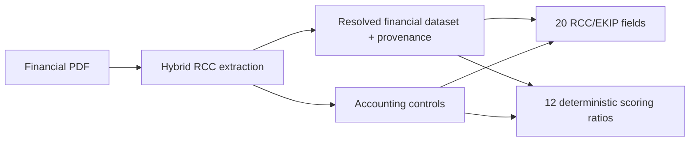

# Full OCR and Extraction Review: RCC and Scoring

**Review date:** 16 August 2026
**Scope:** RCC production service, RCC lab findings, scoring specifications, and scoring reference workbooks
**Explicit exclusion:** CIN/ICE code, prompts, routes, notebooks, assets, and tests were not modified

## Outcome

The RCC pipeline was already substantially stronger than the original GLM-only prototype. This review retained its hybrid architecture and fixed the remaining high-impact preprocessing and table-geometry gaps. The scoring use case had detailed specifications and two formula workbooks but no implemented extraction/scoring service. It now consumes the same resolved financial dataset as RCC and calculates the documented ratios without running a second OCR pipeline.

No final credit score is fabricated. The workbooks and specification do not contain the approved ratio-to-axis scale, official weights, or complete veto policy required for a defensible score.

## Reviewed surfaces

- RCC PDF rendering, source classification, orientation, polarity correction, page classification, GLM extraction, Docling conversion, candidate resolution, accounting controls, and RCC mapping.
- RCC notebook/lab review findings and regression tests.
- Scoring functional/API specifications.
- `Bilans - Analyse.xlsx` and `DEPOULLEMENT BILAN - Note commerciale.xlsx`, including formulas and source labels.
- Existing API job, evidence, dossier, and audit contracts.

## Findings and actions

| Priority | Finding | Risk | Action |
|---|---|---|---|
| High | Inversion correction occurred after semantic orientation OCR | White-on-black scans could fall back to weak geometry before OCR saw a readable image | Polarity and weak contrast are now corrected before the four-way orientation pass |
| High | Retained RapidOCR text came from the downscaled orientation pass | Page classification received sparse text and poor numeric coverage | Added a dedicated 2200-pixel OCR pass on the final upright, corrected, cropped scan |
| High | Docling could assign values through unknown or shifted columns | Ragged Markdown rows could silently swap N/N-1 or use the wrong amount | Require a recognizable header, known value roles, and exact row/header geometry |
| Medium | Native source routing depended primarily on character count | Long PDF noise layers could be treated as born-digital text | Added alphanumeric-density and token-count validation |
| High | Scoring had specifications but no backend implementation | Ratios were trapped in manual Excel models and could diverge from RCC extraction | Added a deterministic scoring service and API view sourced from the RCC dataset |
| High | A separate scoring OCR would duplicate cost and create contradictory facts | Two engines/runs could produce different values for the same statement | RCC and scoring now share one job, one candidate pool, one provenance chain, and one set of controls |
| Critical governance | Official scoring conversion rules are incomplete | A numeric score would be unauditable and potentially misleading | Return 12 ratios and indicative statuses, but `score=null` with an explicit unapproved-policy state |
| Open | Bank-statement/behavioural extraction has no sample corpus or parser contract | The 15% behavioural axis cannot be implemented reliably | Left unimplemented and documented; requires samples, field definitions, ground truth, and approved rules |
| High | Browser-side exports could race unsaved edits and did not expose CSV | Downloaded figures could differ from the persisted dossier | Added authenticated server-side CSV/PDF exports; the UI flushes edits and reloads the dossier before download |
| Medium | The dossier queue and review page did not expose extraction quality at a glance | Analysts had to inspect several panels before choosing the next dossier | Added actionable status KPIs, per-dossier RCC quality, a technical synthesis, and a ratio panel |

## Shared extraction architecture

The scoring endpoints are a facade over the same in-memory job:

- `POST /api/v1/scoring/jobs`
- `GET /api/v1/scoring/jobs/{job_id}`
- `GET /api/v1/scoring/jobs/{job_id}/stream`
- `GET /api/v1/scoring/jobs/{job_id}/result`

The RCC result also contains an optional `scoring` block, allowing one upload to support both consumers.

## RCC dossier exports

The export contract is generated from the persisted dossier after analyst overrides have been applied. A legacy verification whose `corrected_value` is null retains the source OCR value; it is never exported as a missing value.

- `GET /api/v1/rcc/dossiers/{id}/export.csv` returns UTF-8 with BOM and a stable 21-column semicolon schema. It includes dossier metadata, N/N-1 RCC values, accounting controls, compliance rules, ratios, page-level pipeline audit, warnings, and field provenance.
- `GET /api/v1/rcc/dossiers/{id}/export.pdf` returns a deterministic A4 validation report with effective RCC values, confidence/review state, controls, compliance, ratios, pipeline audit, repeated table headers, and page numbering.
- Both endpoints require the analyst session, send `Cache-Control: no-store`, use portable filenames, and set download-safe response headers.
- The browser waits for pending override writes, rejects the download if a save fails, reloads current server state, and only then starts the export.

The PDF renderer uses explicit PyMuPDF coordinates and measured wrapping instead of browser print layout. Long French financial labels, table continuation, section widows, and footers were verified on every generated page.

## RCC dashboard update

- Queue KPI cards filter the dossier list by workflow status.
- A `Qualité RCC` column displays completeness plus the number of analyst-reviewed fields.
- The dossier synthesis displays authoritative server-side completeness, mean OCR confidence, accounting-control coverage, compliance blockers, source type, engines, and ratio availability.
- The scoring panel exposes all available ratios and their formulas/statuses. The final score remains deliberately disabled while the official policy is unapproved.
- CSV and report-PDF actions are visible in the dossier header and remain within the responsive viewport.

## Implemented scoring ratios

| Code | Deterministic formula | Current reference status |
|---|---|---|
| `autonomie_financiere` | Fonds propres / Total bilan × 100 | Indicative threshold |
| `ratio_endettement` | Dettes financières / Fonds propres | Indicative threshold |
| `capacite_remboursement` | Dettes financières / CAF | Indicative threshold |
| `caf_sur_ca` | CAF / CA × 100 | Indicative threshold |
| `rentabilite_commerciale` | Résultat net / CA × 100 | Indicative threshold |
| `rentabilite_financiere` | Résultat net / Fonds propres × 100 | Indicative threshold |
| `rentabilite_economique` | Résultat net / (Fonds propres + Dettes financières) × 100 | Informational until cost-of-debt policy exists |
| `fdr_sur_ca` | FDR / CA × 100 | Indicative threshold |
| `tresorerie_jours_ca` | Trésorerie nette / CA × 360 | Indicative threshold |
| `delai_clients` | Clients / CA × 360 | Indicative threshold |
| `delai_fournisseurs` | Fournisseurs / Achats × 360 | Compared with customer days |
| `croissance_ca` | (CA N − CA N-1) / CA N-1 × 100 | Informational |

Every ratio returns its source components and their extraction status. Missing, invalid, or conflicting inputs and zero denominators produce `non_calculable`, never a silent zero.

## Governance constraints

- `policy_version=reference_workbooks_v1_unapproved`.
- `score=null` and `score_status=not_computed_policy_unapproved`.
- Thresholds are explicitly labeled indicative.
- Ratio inputs retain extraction provenance.
- Accounting conflicts propagate into non-calculable ratios.
- AI recommendation remains separate from any human decision.

## Verification targets

- Unit tests cover native-text noise rejection, pre-orientation inversion correction, the final normalized OCR pass, strict Docling row geometry, consensus/conflicts, deterministic scoring formulas, provenance retention, and zero/missing denominator behavior.
- The existing RCC API/dossier smoke suite must remain green.
- Offline diagnostics remain available without GLM network transmission.
- CIN paths must show no file changes in the final scope audit.

## Verification results

- 18 focused hybrid OCR/scoring/export tests passed.
- The existing API/dossier smoke suite passed, including authenticated scoring results, scoring progress URL checks, authenticated CSV/PDF exports, and post-logout export rejection.
- The production frontend build passed and the dependency audit reported zero known vulnerabilities.
- The RCC queue and dossier screens were exercised in the local browser with no page-level horizontal overflow; the CSV and PDF download paths were tested against the live API.
- The report PDF passed searchable-text assertions and two-page visual QA with no clipped labels, orphaned sections, overlaps, or missing footers.
- Python compilation and `pip check` passed.
- The RCC notebook/lab logic regression script passed all amount, geometry, period, deduplication, provenance, and evaluation checks.
- Born-digital `FDINVEST -Bilan 2025.pdf`: all four pages stayed at 0°, used `native_docling_glm`, and correctly skipped the final RapidOCR pass.
- Image-only `20251224.000028.01.pdf`: pages 2 and 3 resolved to 90°, page 4 to 0°; final normalized OCR retained 1,970, 1,773, and 2,457 characters respectively.
- Strict Docling regression on the same scan: `success`, three tables, 16 conservative candidates, correct N/N-1 roles for clients, asset treasury, total assets, equity, financing debt, suppliers, associate current accounts, and liability treasury.
- The Docling run took approximately 92.9 seconds on the development machine; this is a local benchmark, not an SLA.
- Repository scope audit returned `CIN_UNTOUCHED=YES`.
